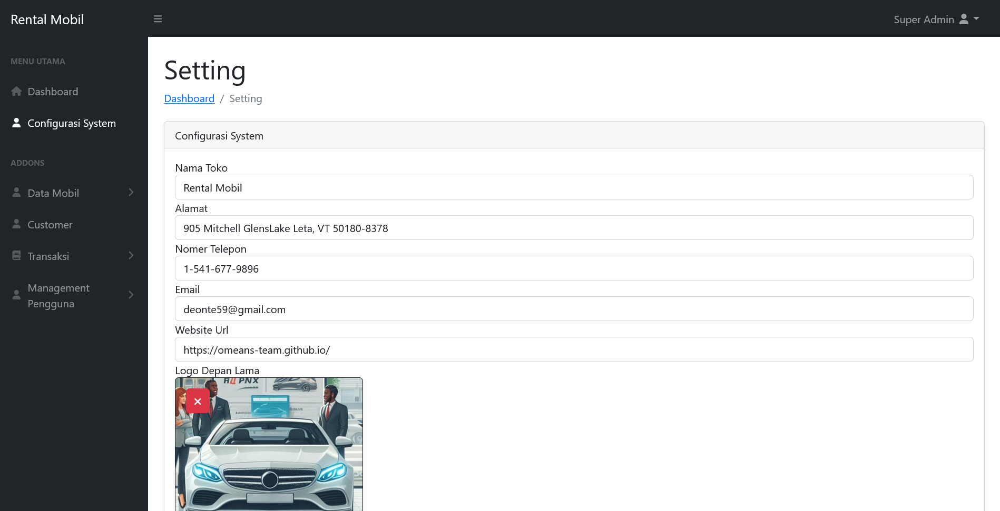
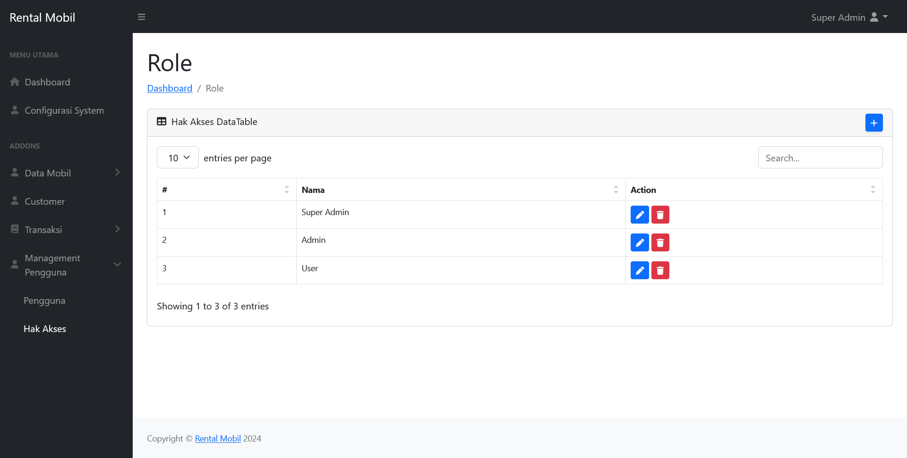

# Project Management

    
    
     
    
    

# Introduction

Rental Mobil New is a web application built using Laravel 10 and PHP 8.2. This application provides a platform for renting cars, making it easy for customers to find and book their desired vehicles.

With a robust and scalable architecture, Rental Mobil New is designed to handle a large volume of users and transactions. The application is built using the latest technologies and best practices, ensuring a fast, secure, and reliable experience for users.

## Features

* User-friendly interface for easy car rental management
* Role-based access control: assign different roles to users, such as super-admin, admin, or user, to control their access and permissions within the system.
* System configuration: easily customize and configure system settings, such as logo system, copyright name, app name, and other identity, to tailor the car rental management system to your business needs.
* And many more...

## Technologies Used

* Laravel 10
* PHP 8.2
* [List other technologies used in the project]
 
## Screenshots

    </img> 
    </img> 
    </img> 
    </img> 
    </img> 
    </img> 
    </img> 
    </img> 
    </img> 
    </img> 
    </img> 
    </img> 

## Contributing

If you're interested in contributing to Rental Mobil New, please see our [contributing guide](CONTRIBUTING.md).

## License

Rental Mobil New is open-sourced software licensed under the [MIT license](https://opensource.org/licenses/MIT).
